

# Kwick Player for Android

**A sleek IPTV player for live TV, movies & series — on your phone, tablet, Fire TV, and Android TV.**

Works on **Fire TV · Google TV · Nvidia Shield · ONN · phones · tablets**

---

## ⭐ Star this repo

If Kwick Player earns a spot on your TV, **drop a star** — it helps other people find it and keeps the updates coming. ⬆️ up top, or right here:

---

## Download

| Edition | Who it's for | Get it |
|:--|:--|:--:|
| **KwickTV Player** | KwickTV members — sign in with just your KwickTV username & password |  |
| **Kwick Player** | Everyone — bring your own Xtream Codes or M3U provider |  |
| **Kwick Player (Play Store)** | Auto-updating install from Google Play |  |

Pick your APK on the **[latest release](https://github.com/Kwickflix/kwicktv-android/releases/latest)**. Every version and its changes are on the **[Releases page](https://github.com/Kwickflix/kwicktv-android/releases)**.

---

## Screenshots

<table>
  <tr>
    <td align="center">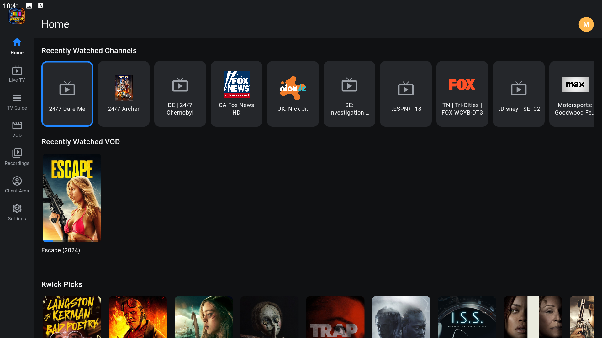 <b>Home</b></td>
    <td align="center">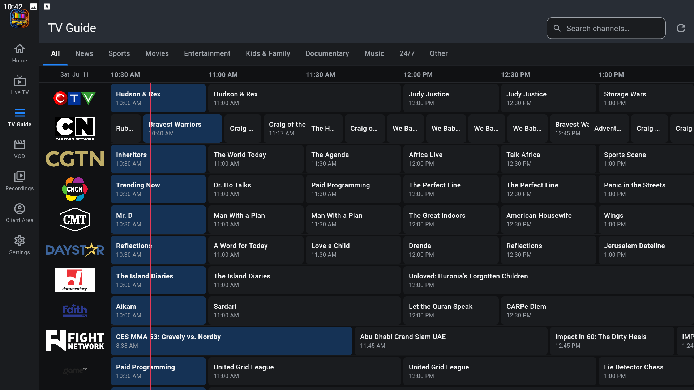 <b>TV Guide</b></td>
    <td align="center">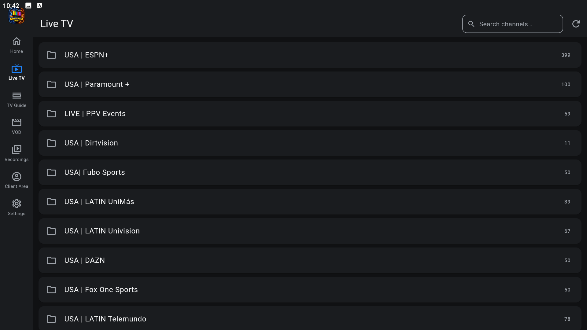 <b>Live TV</b></td>
  </tr>
  <tr>
    <td align="center">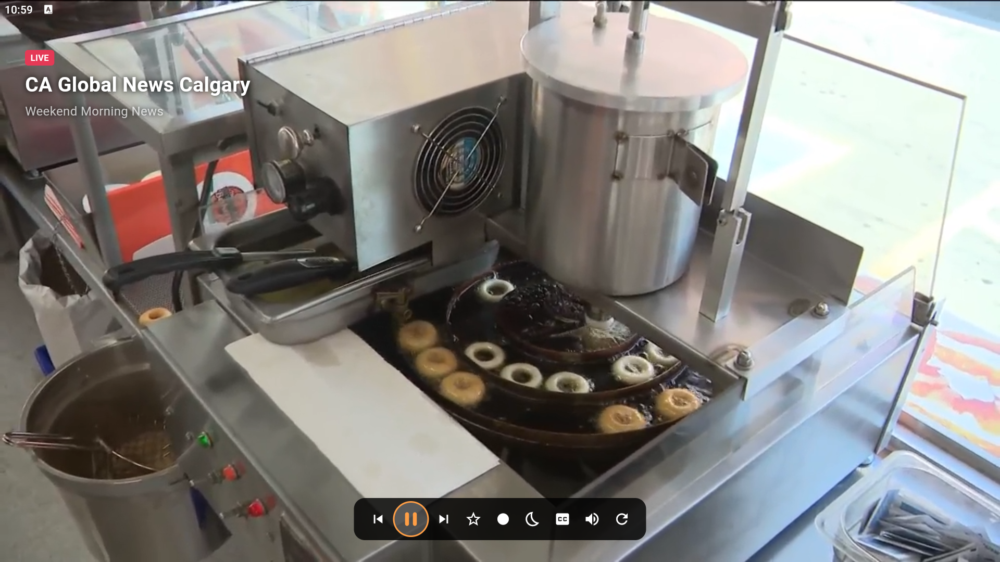 <b>Player</b></td>
    <td align="center">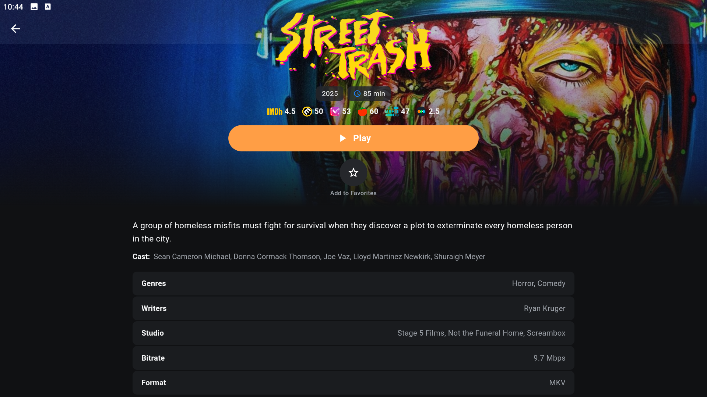 <b>Movies</b></td>
    <td align="center">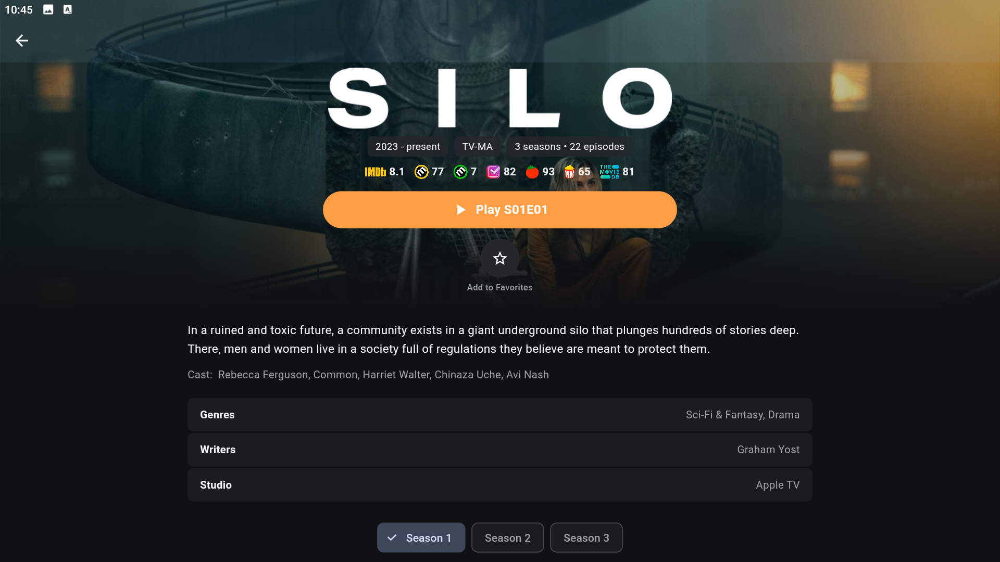 <b>Series</b></td>
  </tr>
</table>

<b>📱 Phone screenshots</b>

 
<table>
  <tr>
    <td align="center">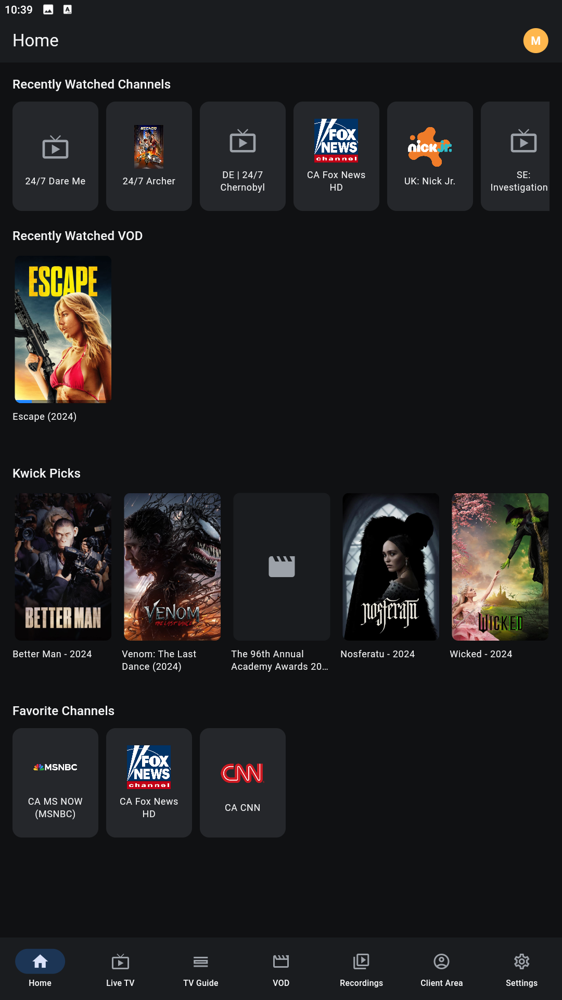 Home</td>
    <td align="center">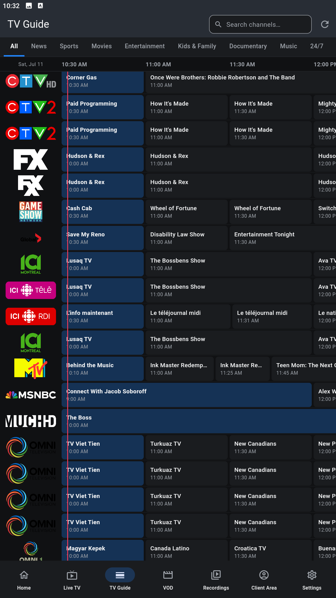 Guide</td>
    <td align="center">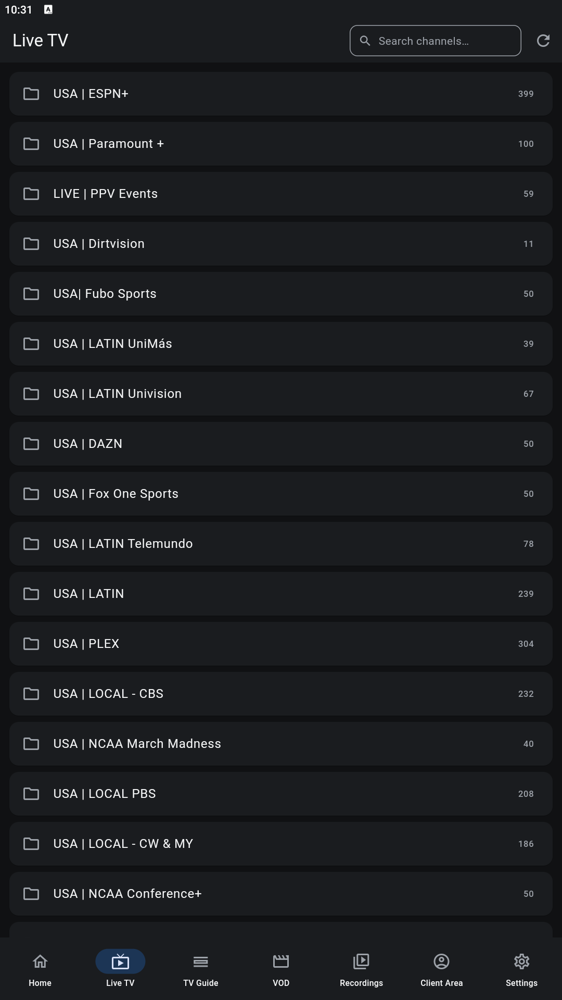 Live TV</td>
    <td align="center">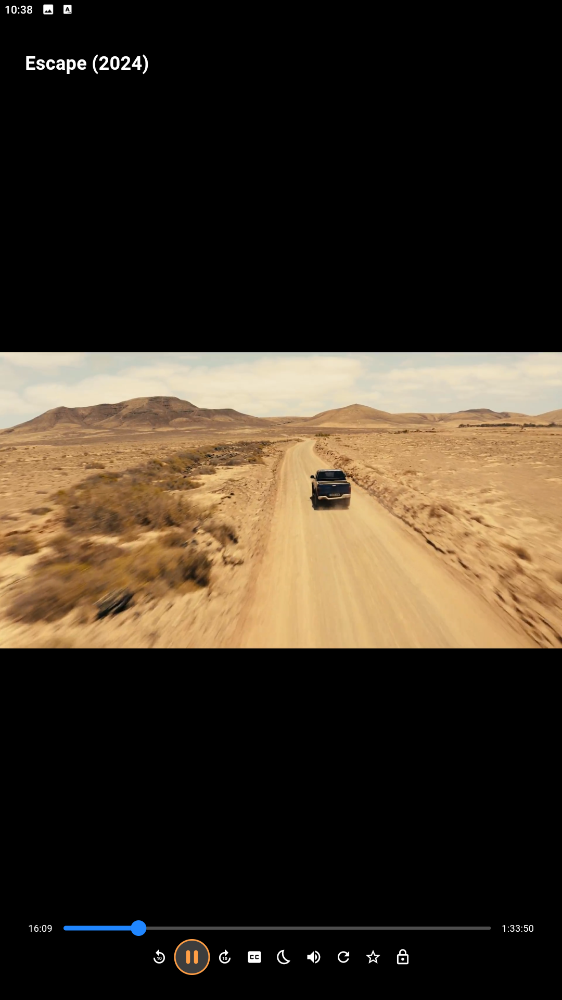 Player</td>
    <td align="center">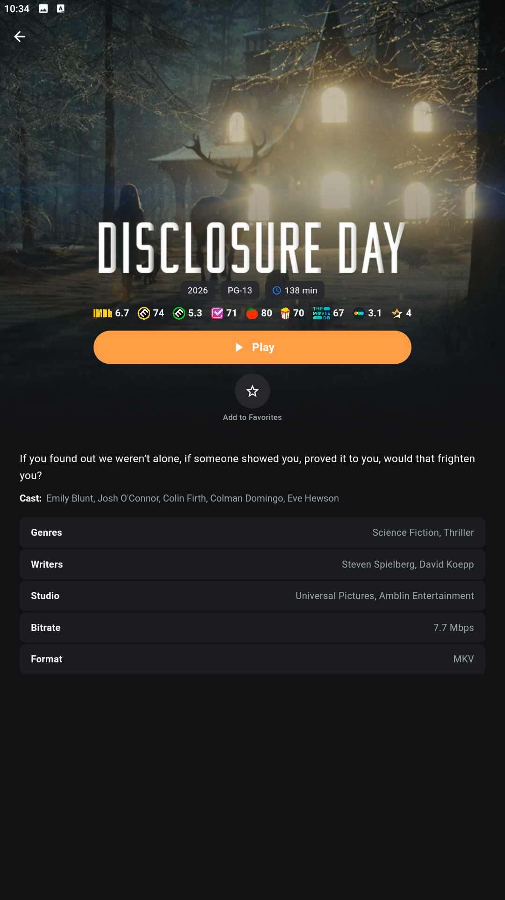 Movies</td>
    <td align="center">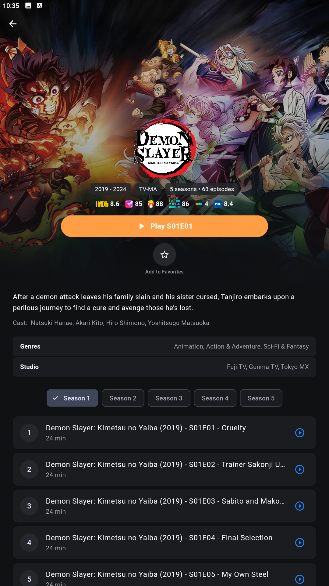 Series</td>
  </tr>
</table>

---

## Features

### 📺 A real TV Guide
A full **timeline grid** like cable — show blocks sized by runtime, a red **NOW line** that moves in real time, and **genre tabs** (News, Sports, Movies, Kids & more) that pull channels from every category together. Pick any show to watch it — or record it.

### 🎬 Movies & Series
Posters, ratings, cast, and details like the big streaming apps. **Resume** tells you how many minutes are left, **Play from Beginning** starts a rewatch fresh, **next-episode buttons** and **auto-play next** keep a binge going, and **Kwick Picks** suggests titles based on what you watch.

### ⭐ Favorite Lists
Make your own named lists — **Sports, Kids, News**, whatever — and drop channels, movies, and series into them. Each list gets its own row on Home; show, hide, rename, or delete them any time.

### ⏺️ Your own DVR
**Record Now** on any channel, or **book upcoming shows from the guide** — recording runs on schedule and keeps going in the background. *(Sideload editions.)*

### 🎮 Made for the remote
Built **D-pad first** — clear focus, every popup lands on the right button. Tested on **Fire TV, Google TV, Nvidia Shield & ONN**.

### 📱 Great on phones too
**Picture-in-Picture** floats the video while you use other apps, and a **screen lock** freezes the screen against pocket-touches.

### 🔒 Parental controls
Set a PIN and lock any live, movie, or series category — hidden completely or PIN-gated, your choice.

### 🎨 Make it yours
**Hide & reorder** categories/channels/favorites, **sort channels**, sleep timer, and themes — including retro **Fallout** (Pip-Boy terminal) and **Final Fantasy** skins.

### 🔗 Bring your other playlists
**Add extra sources** (Xtream or M3U) — their channels, guide, movies & series **merge into one library**.

---

## Install

### Phone / tablet
Download the APK, tap it, allow "install from this source" if prompted.

### Fire TV / Android TV
Use the **[Downloader](https://www.aftvnews.com/downloader/)** app and enter the code:

| Edition | Downloader code |
|:--|:--:|
| KwickTV Player (members) | **4054731** |
| Kwick Player (public) | **6164694** |

---

## Community

Questions, requests, or just want in on the action? Come say hi:

➡️  &nbsp;
➡️  &nbsp;
➡️  &nbsp;
➡️ 

## Contributors

---

Not affiliated with any content provider. You supply your own playlist or subscription.

