

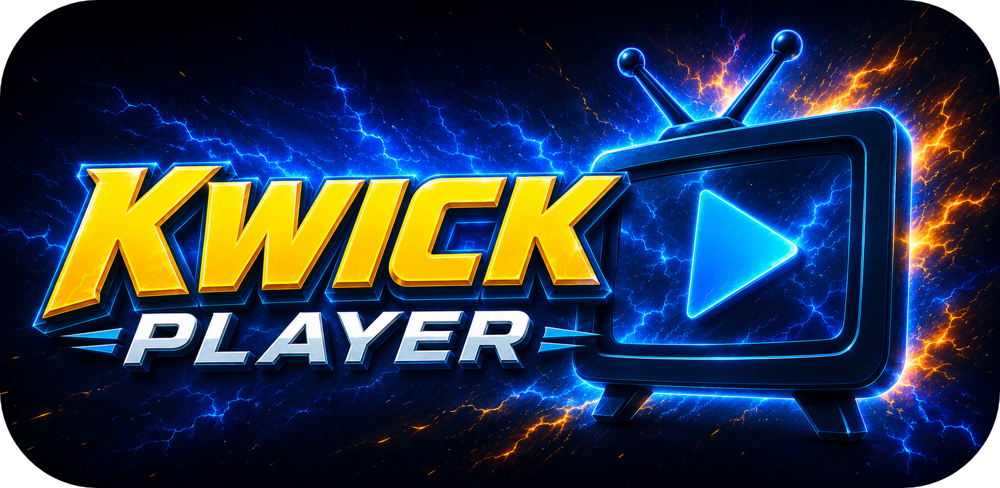

# Kwick Player for Android

**A sleek IPTV player for live TV, movies & series — on your phone, tablet, Fire TV, and Android TV.**

Works on **Fire TV · Google TV · Nvidia Shield · ONN · phones · tablets**

 

### If Kwick Player earns a spot on your TV, give it a star ⭐

---

## Download

| Edition | Who it's for | Get it |
|:--|:--|:--:|
| **KwickTV Player** | KwickTV members — sign in with just your KwickTV username & password |  |
| **Kwick Player** | Everyone — bring your own Xtream Codes or M3U provider |  |
| **Kwick Player (Play Store)** | Auto-updating install from Google Play |  |

Pick your APK on the **[latest release](https://github.com/Kwickflix/kwicktv-android/releases/latest)**. Every version and its changes are on the **[Releases page](https://github.com/Kwickflix/kwicktv-android/releases)**.

---

## 📺 All versions

Kwick Player runs on more than one platform — grab the one for your device:

| Platform | Devices | |
|:--|:--|:--:|
| **Android** | Phones, tablets, Fire TV, Android TV | ⬆️ you're here |
| **Roku** | Roku sticks, boxes & TVs |  |

---

## Screenshots

<table>
  <tr>
    <td align="center"> <b>Home</b></td>
    <td align="center"> <b>TV Guide</b></td>
    <td align="center"> <b>Live TV</b></td>
  </tr>
  <tr>
    <td align="center"> <b>Player</b></td>
    <td align="center"> <b>Movies</b></td>
    <td align="center"> <b>Series</b></td>
  </tr>
</table>

<b>📱 Phone screenshots</b>

 
<table>
  <tr>
    <td align="center">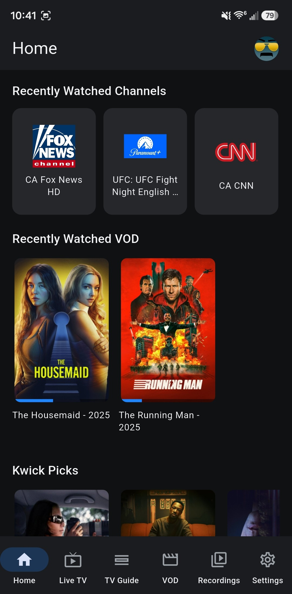 Home</td>
    <td align="center">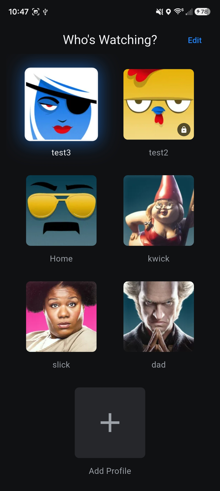 Who's watching?</td>
    <td align="center">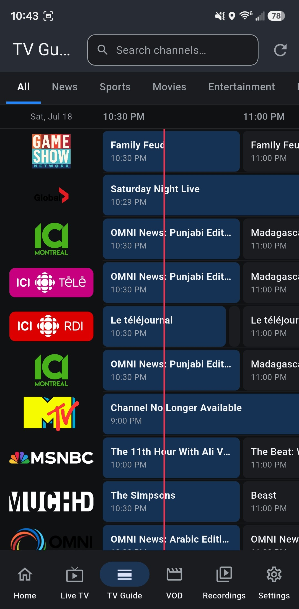 Guide</td>
    <td align="center">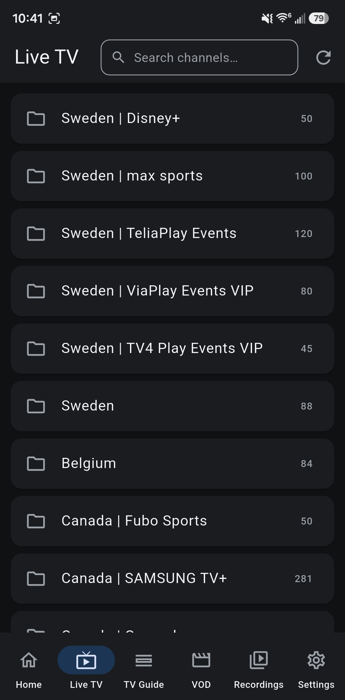 Live TV</td>
    <td align="center">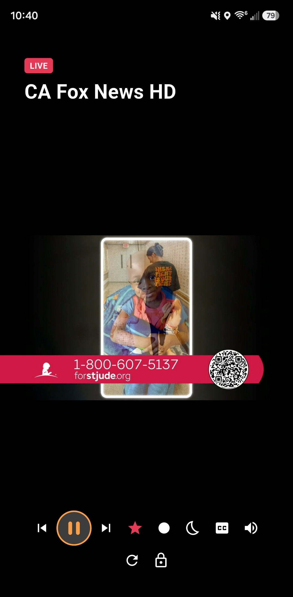 Player</td>
    <td align="center">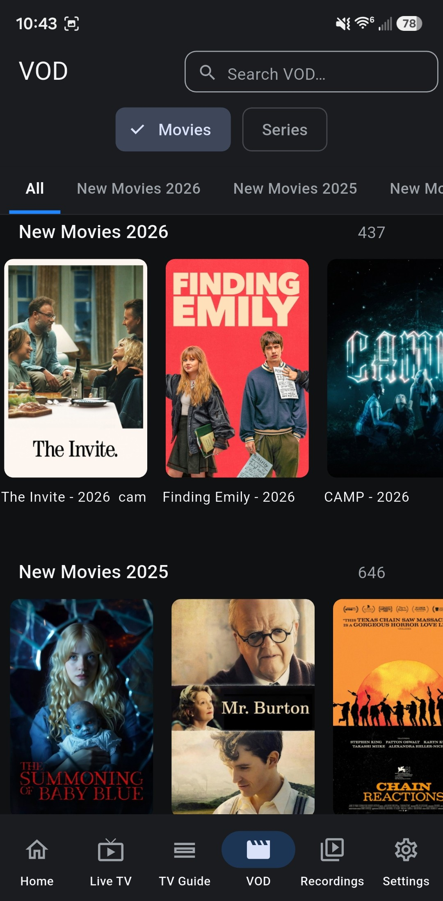 Movies</td>
  </tr>
  <tr>
    <td align="center">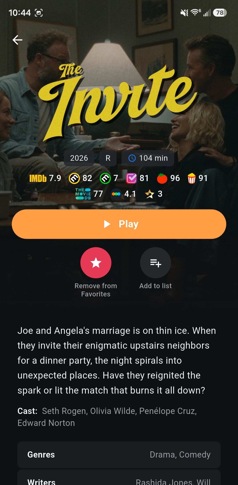 Movie details</td>
    <td align="center">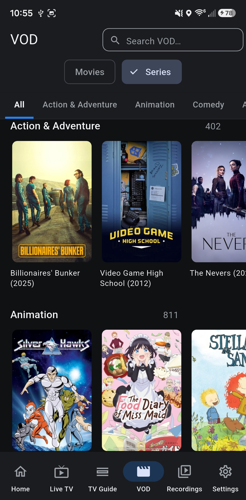 Series</td>
    <td align="center">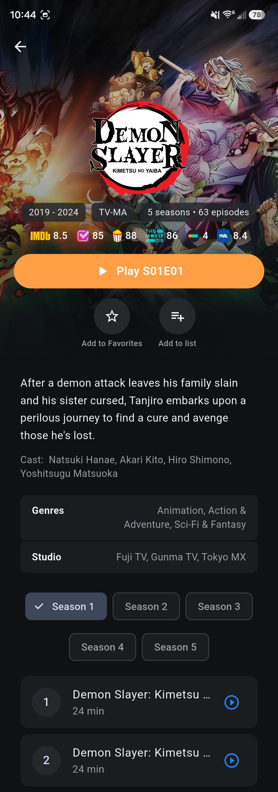 Series details</td>
    <td align="center">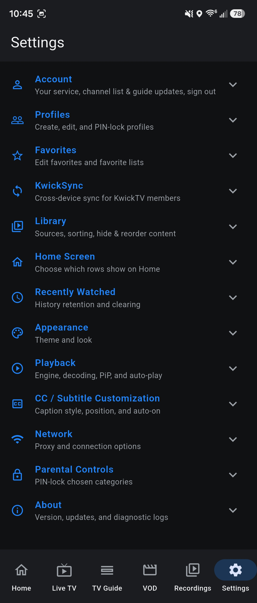 Settings</td>
    <td align="center">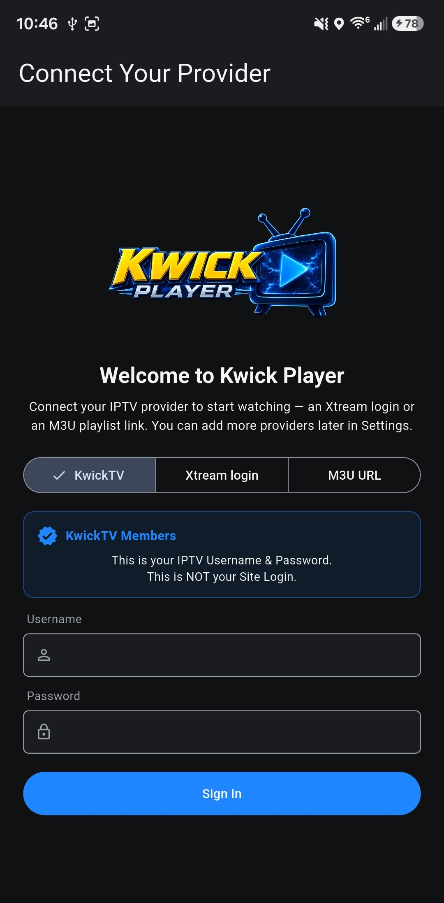 Sign in</td>
    <td></td>
  </tr>
</table>

---

## Features

- **👤 Profiles** — Netflix-style "Who's watching?" with a 315-avatar pack, optional profile PINs, and separate favorites, lists, settings, and watch history per profile.
- **🔄 KwickSync** — KwickTV members: your profiles, favorites, lists, watch history & settings follow you to every device automatically — phone, tablet, TV box, even the Roku app.
- **💬 Captions & subtitles that actually work** — closed captions on live TV (both player engines), full subtitle-track menus on movies & series, and a CC / Subtitle Customization section: position, text size, colors, background box, preferred language, and auto-on.
- **📺 A real TV Guide** — full timeline grid like cable, a red NOW line, and genre tabs (News, Sports, Movies, Kids…) pulling channels from every category together.
- **🎬 Movies & Series** — posters, ratings, and cast; Resume / Play from Beginning, next-episode buttons, auto-play next, and Kwick Picks suggestions.
- **⭐ Favorite Lists** — make your own named lists (Sports, Kids, News…) and drop channels, movies, and series into them; each list gets its own Home row.
- **⏺️ Your own DVR** — Record Now on any channel or book upcoming shows from the guide; recordings run in the background. *(Sideload editions.)*
- **▶️ Two player engines** — the feature-packed default, or Android's built-in ExoPlayer for TVs that stutter on some streams. Captions work on both.
- **🎮 Made for the remote** — D-pad-first design tested on Fire TV, Google TV, Nvidia Shield & ONN.
- **📱 Great on phones too** — lock-screen media controls (see what's playing, pause/resume), a fullscreen edge-to-edge mode, background listening with the screen off, Picture-in-Picture, and a screen lock against pocket-touches.
- **🛟 One-tap support** — Export Logs sends diagnostics straight to the team, and Discord & Telegram are one tap away in Settings.
- **🔒 Parental controls** — PIN-lock any live, movie, or series category (hidden completely or PIN-gated).
- **🎨 Make it yours** — hide & reorder categories/channels/favorites, sort channels, sleep timer, and themes (including retro Fallout & Final Fantasy skins).
- **🔗 Bring your other playlists** — add Xtream or M3U sources and everything merges into one library.

---

## Install

**Phone / tablet** — download the APK, tap it, allow "install from this source" if prompted.

**Fire TV / Android TV** — use the **[Downloader](https://www.aftvnews.com/downloader/)** app and enter the code:

| Edition | Downloader code |
|:--|:--:|
| KwickTV Player (members) | **4054731** |
| Kwick Player (public) | **6164694** |

---

## 🙌 Contributors

Kwick Player is shaped by our community — the features below started as member requests. Huge thanks to:

- **Ed** — subtitle & captions debugging, next / previous episode buttons, now-playing in the channel list
- **Duffy** — the idea for KwickSync, auto-reconnect on stalls, Play from Beginning, Fallout theme tuning & fixes
- **Tiredofitall** — auto-play next episode
- **ZZ** — Movies/Series category bar, Show Recently Watched toggle
- **UnderDeztrukshun** — Picture-in-Picture on/off
- **T.Icarus** — move-to-top & drag reordering
- **Mred0940** — Favorite Lists
- **Inno** — and everyone in the community who tests, reports, and requests 💙

---

Not affiliated with any content provider. You supply your own playlist or subscription.

